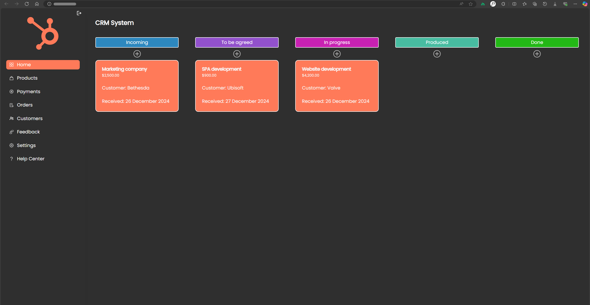

# CRM System



A modern, high-performance Customer Relationship Management (CRM) system designed for efficiency and scalability. Built with the latest **Nuxt 4** ecosystem and **Supabase** backend.

## 🚀 Overview

This project is a full-featured CRM platform that allows users to manage sales pipelines, track customer interactions, and handle orders in real-time. The application leverages a reactive architecture for a seamless user experience.

## 🌐 Live Demo
You can try the live prototype here:

**Demo:** [click here](https://crm-system-prototype.vercel.app/)

Use the following demo credentials:

```text
Email: user@test.com
Password: user
```

## ✨ Key Features

* **📊 Kanban Pipeline:** Visual lead management using a Kanban board.
* **🔗 Smart Ordering:** Implemented **Lexorank** algorithm for ultra-efficient drag-and-drop reordering.
* **⚡ Real-time Sync:** Instant database updates powered by Supabase.
* **📂 Nuxt 4 Ready:** Utilizing the latest directory restructure and performance optimizations.
* **🌍 Multi-Language:** Built-in localization for English and Ukrainian.
* **🌗 Adaptive UI:** Dark and Light mode support out of the box.
* **📡 Robust Data Fetching:** Advanced caching and synchronization with TanStack Vue Query.

## 🛠 Tech Stack

* **Frontend:** [Nuxt 4](https://nuxt.com/) (Vue 3.5+)
* **Backend as a Service:** [Supabase](https://supabase.com/) (Auth, Database, Realtime)
* **Data Hooks:** [TanStack Vue Query v5](https://tanstack.com/query/latest)
* **Styles:** SCSS (Sass), [Nuxt Fonts](https://fonts.nuxt.com/), [Nuxt Icon](https://github.com/nuxt-modules/icon)
* **Algorithms:** [Lexorank](https://github.com/dalet-oss/lexorank) for sorting efficiency.
* **Linting:** [Nuxt ESLint](https://eslint.nuxt.com/)

## 📂 Project Structure

This project uses the **Nuxt 4** structure:

* `app/` — Main application logic (pages, components, assets, composables).
* `server/` — API routes, server middleware, and Nitro plugins.
* `shared/` — Shared TypeScript types and utility functions.

## ⚙️ Setup & Installation

### Prerequisites

* Node.js (v20.x or higher)
* pnpm (v10.x+)

### Installation

1.  **Clone the repository:**
    ```bash
    git clone https://github.com/PetyaBiszeps/CRM-system.git
    cd crm-system
    ```

2.  **Install dependencies:**
    ```bash
    pnpm install
    ```

3.  **Environment Variables:**
    Create a `.env` file in the root:
    ```env
    SUPABASE_URL=your_project_url
    SUPABASE_KEY=your_anon_key
    ```

4.  **Development Mode:**
    ```bash
    pnpm dev
    ```

5.  **Build for Production:**
    ```bash
    pnpm build
    ```

## 📜 Roadmap

- [ ] Advanced analytics and reporting dashboard.
- [ ] Client portal for order and task tracking.
- [ ] Payment, customer tracking support.
- [ ] Email automation & integration.

---

Developed by [Me, huh](https://github.com/PetyaBiszeps)